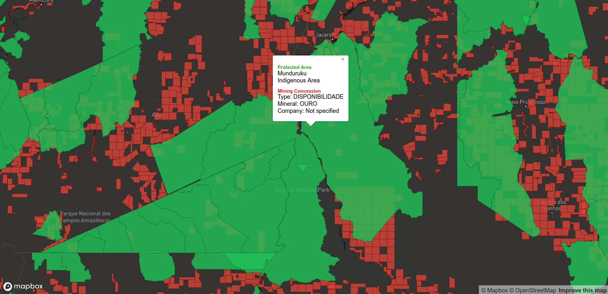

# Setup

## Download datasets

- [`WDPA_June2019-shapefile.zip`](https://www.protectedplanet.net/downloads/WDPA_Jun2019?type=shapefile), from [Protected Planet](https://www.protectedplanet.net/), downloaded June 21, 2019. [More info](http://pp-import-production.s3.amazonaws.com/WDPA_Manual_1_5.pdf).
- [`Mining_concessions.zip`](https://opendata.arcgis.com/datasets/26a457ee3b584824bb930f2ec791b60d_0.zip), from [Global Forest Watch](http://data.globalforestwatch.org/datasets/26a457ee3b584824bb930f2ec791b60d_0/data), downloaded June 21, 2019, last updated 4/2/2019. [More info](https://www.arcgis.com/sharing/rest/content/items/26a457ee3b584824bb930f2ec791b60d/info/metadata/metadata.xml?format=default&output=html).
    - Note this data is only available for: Cameroon, Cambodia, Canada, Colombia, Republic of the Congo, Gabon, and Democratic Republic of the Congo (DRC), Peru, Brazil and Mexico

```
mkdir data
wget https://opendata.arcgis.com/datasets/26a457ee3b584824bb930f2ec791b60d_0.zip -O mining_concessions.zip
unzip mining_concessions.zip -d data/concessions

wget https://www.protectedplanet.net/downloads/WDPA_Jun2019?type=shapefile -O wdpa.zip
unzip wdpa.zip -d data/protected
```

## Install dependencies

```
pip install -r requirements.txt

# Setup tippecanoe for generating mapbox tiles
git clone https://github.com/mapbox/tippecanoe.git
cd tippecanoe
make -j
make install
```

## Generate Mapbox tiles

```
# First, convert to geojson
# Note: these files are large, so this will take awhile.
python to_geojson.py

# <https://docs.mapbox.com/help/troubleshooting/large-data-tippecanoe/>
tippecanoe -o out.mbtiles -zg --drop-densest-as-needed data/concessions.json data/protected.json
```

Then upload to Mapbox studio as a tileset. These tiles are loaded into the map visualization.

# Run intersection script

To compute how many mining concessions overlap with protected areas, run:

```
python compute_intersections.py

extending protected area radius by meters: 1000.0
p concessions intersecting w/ at least one protected area: 0.7174499140054851
mean intersections w/ protected areas: 1.7346096947314997
```