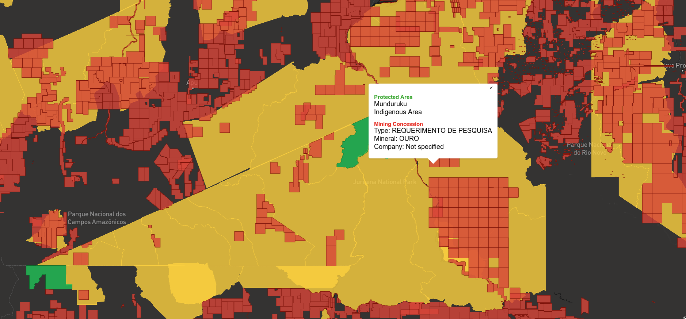

# Setup

## Download datasets

- [`WDPA_June2019-shapefile.zip`](https://www.protectedplanet.net/downloads/WDPA_Jun2019?type=shapefile), from [Protected Planet](https://www.protectedplanet.net/), downloaded June 21, 2019. [More info](http://pp-import-production.s3.amazonaws.com/WDPA_Manual_1_5.pdf).
- [`Mining_concessions.zip`](https://opendata.arcgis.com/datasets/26a457ee3b584824bb930f2ec791b60d_0.zip), from [Global Forest Watch](http://data.globalforestwatch.org/datasets/26a457ee3b584824bb930f2ec791b60d_0/data), downloaded June 21, 2019, last updated 4/2/2019. [More info](https://www.arcgis.com/sharing/rest/content/items/26a457ee3b584824bb930f2ec791b60d/info/metadata/metadata.xml?format=default&output=html).
    - Note this data is only available for: Cameroon, Cambodia, Canada, Colombia, Republic of the Congo, Gabon, and Democratic Republic of the Congo (DRC), Peru, Brazil and Mexico

```
mkdir data
wget https://opendata.arcgis.com/datasets/26a457ee3b584824bb930f2ec791b60d_0.zip -O mining_concessions.zip
unzip mining_concessions.zip -d data/concessions

wget https://www.protectedplanet.net/downloads/WDPA_Jun2019?type=shapefile -O wdpa.zip
unzip wdpa.zip -d data/protected
```

## Install dependencies

```
pip install -r requirements.txt

# Setup tippecanoe for generating mapbox tiles
git clone https://github.com/mapbox/tippecanoe.git
cd tippecanoe
make -j
make install
```

## Calculate overlaps

General procedure:

1. `python compute_candidates.py`
    1. Index protected area bounding boxes in a q-tree for fast lookups
    2. Get protected area bounding box intersections against mining concession bounding boxes
    3. Convert shapes to Web Mercator projection
    4. Generate geojson files for mining concessions and protected areas, filtering protected areas to only those in countries with mining concession data
2. `./compute_intersections 1000 data/intersection_candidates.json data/concessions.json data/protected.json data/intersections.json`
    1. Because a bounding box intersection does not necessarily mean a shape intersection, we have to check that the shapes also intersect or are within a specified buffer distance
3. `python to_geojson.py`
    1. Generates the geojson data necessary for creating the Mapbox tileset, converting back to WGS84

Then generate Mapbox tiles:

```
# <https://docs.mapbox.com/help/troubleshooting/large-data-tippecanoe/>
tippecanoe -f -o data/tile/tileset.mbtiles -zg --drop-densest-as-needed data/tile/concessions.json data/tile/protected_overlap.json data/tile/protected_no_overlap.json
```

Then upload to Mapbox studio as a tileset. These tiles are loaded into the map visualization.